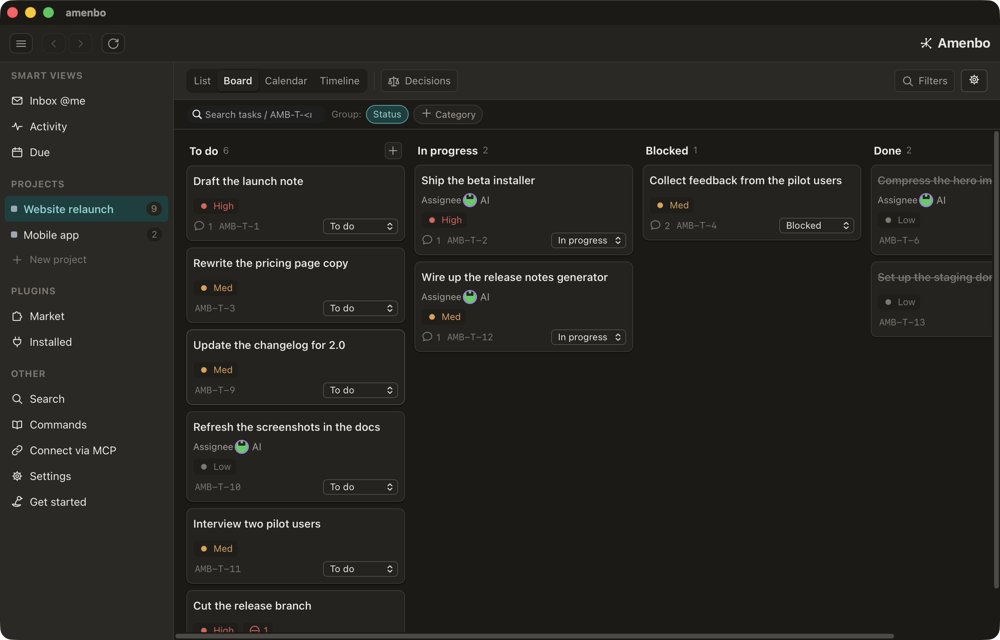

<div align="center">

<!-- The mark is drawn on no ground of its own, so the page lays one: black on a light ground,
     white on a dark one. GitHub picks between the two by the reader's theme. -->
<picture>
  <source media="(prefers-color-scheme: dark)" srcset="assets/brand/web/mark-inv-512.png">
  
</picture>

# amenbo

**Task management for AI agents — the record lives outside the AI.**

<!-- The badges belong on one line of source: a single newline is a hard break in GFM, so one per line
     would stack them into a column. -->
[](LICENSE) [](https://github.com/ShiroDoromoto/amenbo/actions/workflows/ci-change.yml) [](https://github.com/ShiroDoromoto/amenbo/releases) 

**[Download](https://amenbo.work/en/start/)** · **[Docs](#contents)** · **[Commands](#commands)**

</div>

**[amenbo.work](https://amenbo.work/en/)** — the site: what this is for, and the installers.

The context you build up with an AI goes down with it: the session ends, or you move to
another agent, and none of what you worked out is written down anywhere. Amenbo keeps it
on your machine instead — tasks and decisions as connected records in one SQLite store,
which an agent writes through the CLI and you read in the desktop app.

- **Outside the agent** — the record belongs to the store, not to a session, so it does
  not reset when the agent you are working with changes. It is one SQLite file on your
  machine, and `amenbo export` writes all of it out whenever you want.
- **Connected records** — tasks carry dependency edges, decisions cross-link to the tasks
  they bear on, and `task reject --reason` keeps why something was dropped.
- **The spec is in the binary** — `amenbo agent --json` is what an agent reads to work
  here: how to work in this folder, plus every command's flags, arguments and examples.
  It ships with the build, so there is no command reference to drift out of date.

<!-- Folded, not dropped: these three say how the store is built rather than what it is for,
     and the opening screen is for the latter. -->
<details>
<summary>Three more, on how the store holds up</summary>

- **The folder is the boundary** — an agent started in a folder you bound operates that
  folder's project, and reading or writing another project's tasks, decisions or comments
  is refused with `out_of_reach`. One machine holds every project you have.
- **Safe to write from two places at once** — concurrent writers to the store are
  serialized by an exclusive file lock, and the database runs in WAL mode.
- **CLI-first** — a Rust core library does the domain work; the CLI is a thin shell on top of it.

</details>

> Status: the core, the CLI, and a desktop GUI are implemented. The store is a local
> SQLite database — the single source of truth. There is no server, and nothing leaves
> your machine.

<div align="center">



<sub>The desktop app — the same store the CLI writes to, on a board.</sub>

</div>

## Contents

- [Layout](#layout)
- [Toolchain](#toolchain)
- [Build and run](#build-and-run)
- [Installing and updating](#installing-and-updating)
- [Commands](#commands)
- [Making your AI agent read the spec](#making-your-ai-agent-read-the-spec-optional)
- [Reaching Amenbo from an AI that cannot open a folder](#reaching-amenbo-from-an-ai-that-cannot-open-a-folder)
- [Encryption at rest](#encryption-at-rest)
- [Contributing](#contributing)
- [License](#license)

## Layout

```
crates/
  amenbo-core/        domain model, persistence, operations, queries, export
  amenbo-cli/         the `amenbo` binary (clap; human + --json output; `agent --json`)
  amenbo-scratch/     test support: the throwaway directory a test works in
  amenbo-static-host/ test support: a loopback host, for what is reached by URL
app/                  the desktop GUI shown above (React + Vite front end; Tauri shell
                      in `app/src-tauri`, calling amenbo-core directly — no server)
assets/               the CLI demo and its script, the GUI screenshot
  brand/              the mark: the origin SVGs — the delivered drawing, and the redraw that
                      keeps a whole-pixel stroke at 32px and below — and the icons and
                      rasters `make brand` bakes from them (the only place a coordinate
                      is written)
verification/         black-box checks of an installed build, run before a release
                      (its own cargo workspace, so `make test` never pulls it in)
devtool/              optional Go helper: a throwaway dev GUI per task, the VM it is driven
                      in, and a fake outside world
guards/               one invariant apiece, asserted over the tree by `make test` and CI
scripts/              what the Makefile calls out to — build, sign, notarise, verify,
                      bake the brand set — and a few meant to be typed by hand, such as
                      watch-ci.sh, which watches one CI run and prints only what changes
  windows/            drive a real Windows desktop from here, for the roads out of the
                      app that only a physical machine can walk
```

Design points:

- **Persistence**: the local store is a single SQLite file — the single source of
  truth the queries run against. JSON is an export format you can produce anytime
  (`amenbo export`).
- **IDs**: the id **is** the conversational number — a task whose id is `<n>` is shown
  as `AMB-T-<n>`, a decision whose id is `<n>` as `AMB-D-<n>`. Numbers are device-global
  (one number names one task anywhere, no project context needed) and come from two
  sibling spaces, which the kind code disjoins. Every ref Amenbo shows carries the
  `AMB-` namespace, so it is self-declaring: another tracker's `T-<n>` is never
  mistaken for one of these. Reading is looser than writing — the bare forms
  (`<n>` / `#<n>` / `T-<n>` / `D-<n>`) still parse, so a ref pastes straight back.
- **Ordering**: fractional index; a task's placement (project, order) lives on the
  task itself. Classification (categories, phases, or any axis you define) is
  expressed with user-defined **dimensions**, not a fixed hierarchy.
- **Relationships**: a single dependency edge (`task depend`). There are no
  subtasks — decompose larger work into separate tasks linked by dependencies.
- **Deletes**: physical and irreversible. Deleting a project deletes the tasks,
  decisions and dimensions under it. To keep something without seeing it, archive
  it (`project archive`) instead.
- **One task, one project**: a task belongs to exactly one project; `task move`
  re-homes it — a row changing hands inside one database, not a copy.

## Toolchain

<details>
<summary>Pinned Node + Rust, one-shot setup, and the macOS-only GUI note</summary>

Node and Rust versions are pinned in the repo so everyone builds with the same
toolchain (no OS-global change needed). The pin files — `.nvmrc` / `.node-version`
(Node 24, Active LTS), `rust-toolchain.toml` (Rust 1.96.0 + rustfmt/clippy), and
`.tool-versions` (both) — are read by the common per-project version managers, so
no single tool is forced.

```bash
# Recommended: mise installs Node + Rust from the pin files in one shot
mise install

# Alternative: nvm + rustup (each reads its own pin file)
nvm use            # picks up .nvmrc
rustup show        # rust-toolchain.toml is applied on the next cargo command
```

`package.json` declares `engines.node >= 22.12` (the build deps' floor); the pin
files select the exact version above that.

Go appears in the tree, but it is not a third toolchain to install: it builds only
`devtool/`, the optional helper that gives a task its own throwaway dev GUI and
raises the VM that GUI is driven in (see
[devtool/README.md](devtool/README.md)). Nothing else reads it, so Amenbo builds,
tests and ships without Go — `make devtool` is the only target that asks for it.

**Building the GUI is macOS-only.** The Tauri `.app` links the native WebKit
(WKWebView), so it can't be built or run in a Linux container — Docker /
devcontainers only suit the headless side (core / CLI / tests / CI on Linux).
The `make gui` / `install-gui` targets (and their `-dev` variants) require host
macOS; the CLI builds anywhere Rust does (`make install-dev` for a local dev
build — the prod CLI ships inside the unified installer, so `make install` is
retired).

</details>

## Build and run

<details>
<summary>Build, the fast/full test split, the nextest + shell gates, and where data lives</summary>

```bash
cargo build
cargo test                              # fast: unit + light integration suites
cargo test --features scale,e2e         # full: also the scaling guard and the real-binary cli_e2e_* suites
cargo run -p amenbo-cli -- agent --json   # the single source of truth for the CLI
```

The heaviest tests are gated behind cargo features so the everyday `cargo test`
stays sub-second: the read-hotpath scaling guard behind `scale`, the real-binary
`cli_e2e_*` suites behind `e2e`. CI enables both (`--features scale,e2e`).

For the full run, [`cargo-nextest`](https://nexte.st) is faster (per-test process
isolation + parallelism) and prints per-test timings so the slow tests are easy to
spot — `make test` wraps it (and runs the doctests nextest skips). It also gates the
out-of-workspace Tauri host crate (`app/src-tauri`), the GUI front-end, and the shell
scripts that drive the release and the on-hardware checks, mirroring CI's `app-rust` +
`gui-web` + `shell` jobs, so a core change that only breaks the GUI — or a quoting slip
in a release script — is caught locally. `make gate` runs the same stages, minus the ones
your change cannot have moved: which layer a path belongs to is declared in
`.github/paths-filters.yml`, the file CI gates its own jobs on, and a path on no layer falls
back to the whole of `make test`:

```bash
cargo install cargo-nextest            # one-time (or https://get.nexte.st)
brew install shellcheck actionlint     # one-time (the shell gate; any package manager will do)
make test                              # shell gate + core/cli (scale,e2e + doctests) + app crate clippy/test + GUI typecheck/build/test
make gate                              # the same, narrowed to the layers your change touched (a path on no layer falls back to the whole of make test)
make shell-gate                        # the shell leg on its own (every tracked *.sh and git hook, plus the shell embedded in each workflow's run:)
cargo nextest run --features scale,e2e # core/cli only, without the doctest + GUI legs
```

The Tauri host crate and the verification harness each sit outside the workspace with a
lockfile of their own, but both reach core through a path dependency — so a workspace bump
moves what those locks resolve to without touching the files. CI's `out-of-workspace-locks`
job fails a pull request whose copies are behind; `make lock` re-resolves both (seconds,
nothing is compiled) and the result is yours to commit.
Dependabot's own bumps are repaired for it, ahead of the merge — see `lockstep` in
`.github/workflows/_dependabot-automerge.yml`. That repair pushes with the workflow's own
token, which starts no run, so on the bumps that do move a lock the same workflow dispatches
the full gate against the branch: the head it just made gets a verdict of its own, and the
merge it armed lands on that.

The DB layer is [rusqlite](https://docs.rs/rusqlite) and nothing else: the change feed rides
SQLite's update hook, which belongs to the connection, and reads are issued from inside the
write transaction — both are lost the moment a second library opens a connection of its own.
The schema is declared once, in the `store_engine::schema` registry, and the `CREATE TABLE`
DDL and the per-column write whitelist are derived from it, so they cannot drift apart.

A gate only ever compiles the cfg branches of the OS it runs on, so `#[cfg(target_os =
"linux")]` code (the store-watch network-FS path, for one) is invisible to a green run on a
mac. `make lint-linux` builds the tree for Linux inside the container the Linux bundles are
built in, running the same two clippy invocations as CI's `lint` + `app-rust` jobs. Cross-
compiling won't do: the Tauri gtk/glib sys crates need their system deps at build time, so
a real Linux is the only way to reach that code. It needs Docker and takes a few minutes,
which is why it is not part of `make test` — reach for it when you touch an OS-gated branch.

Plain `cargo test` still works everywhere; nextest is an optional accelerator.
Thresholds and the `ci` profile live in `.config/nextest.toml`.

Data is stored under the OS-standard location (on macOS,
`~/Library/Application Support/amenbo/store.sqlite`). Set `AMENBO_HOME` to
override the location (useful for tests and explicit setups).

</details>

## Installing and updating

<details>
<summary>Per-OS installers, in-place CLI self-update, and verifying a download</summary>

On macOS and Windows Amenbo ships as a single installer that carries both the GUI and
the CLI (a `.pkg` and an NSIS `.exe`), published on this repository's
[Releases](https://github.com/ShiroDoromoto/amenbo/releases). Download the one for
your platform and run it — it installs the desktop app and puts the `amenbo` CLI on
your PATH in one step. The macOS `.pkg` is signed with an Apple Developer ID and
notarized, so it installs and launches with no warning. The Windows installer is not
yet signed, so its first run shows SmartScreen's **More info** → **Run anyway**; once
approved it does not recur.

On Linux the GUI is an **AppImage**, published on the same page: a single
self-contained file that needs no root — place it on your PATH yourself (e.g.
`~/.local/bin`) and run it. It carries the GUI only; the `amenbo` command comes from
the CLI installer, which is per-user too.

If a system-wide `.deb`/`.rpm` from an older release is still installed, retire it
yourself when you move to the per-user AppImage/CLI — the per-user build cannot (it is
not root): `sudo apt remove amenbo` on Debian/Ubuntu, or `dpkg -r amenbo` / `rpm -e
amenbo` elsewhere. The CLI reminds you once while a `/usr/bin` copy is still present;
on the stock PATH `~/.local/bin` wins, so a leftover copy is harmless beyond the
version skew.

To update, download the latest installer and run it again — it replaces both the
desktop app and the CLI at once (on Linux the new AppImage replaces the GUI, and the
CLI updates on its own path). Amenbo notices when a newer version is out (see the
update check below) and points you at that installer. A **standalone CLI** (installed
without the desktop app) can also update itself in place: `amenbo update --apply`
downloads the new CLI over TLS and swaps this binary — no installer, no elevation. A
CLI installed alongside the desktop app is managed by it and is updated with the app,
not on its own (`--apply` there points you back to the installer). An `--apply` keeps the
binary it replaces beside the new one, so `amenbo update --rollback` undoes the last update
offline — no download — if the new version misbehaves. Either way, applying an update is
always your explicit call — Amenbo never updates itself in the background.

**Verifying a download (optional).** Every release is built by this repository's
public CI, and each asset carries a build attestation signed with the release
workflow's GitHub OIDC identity — not a key on anyone's laptop. With the
[GitHub CLI](https://cli.github.com) you can confirm an installer was built from
this source at a known commit, and not tampered with or produced elsewhere:

```bash
gh attestation verify amenbo-darwin-arm64.pkg --repo ShiroDoromoto/amenbo
```

A pass means the bytes you are about to run came from this repo's release workflow.
Substitute your platform's asset name.

On the network, Amenbo keeps two layers apart. **Feature-side communication stays
at zero**: no telemetry, no phone-home, no central server — your task data never
leaves your device. What does go out is **infra-side**, and there are two kinds.

The **update check** reads a small manifest from Amenbo's own update endpoint to
notice when a newer version is out. That request carries no task data, is on
by default, and can be turned off (`amenbo config set update_check false`, or
`AMENBO_UPDATE_CHECK=0`). Only a released Amenbo makes it at all: a build that did not
come out of the release workflow has no version to be measured against that manifest, so it
does not ask — which is also what keeps this repository's own builds and test runs off the
endpoint. The check only reads that manifest; Amenbo never updates
itself in the background — downloading and applying a new version is always something you
set off yourself (`amenbo update`, or `amenbo update --apply` for the standalone CLI).

**Looking for a plugin** reads the plugin catalog — one static file, fetched once and
cached, whatever the catalog's size — and, for a plugin whose detail you open, that one
repository's stars and downloads from GitHub's public API, plus its README where the
plugin's author wrote no description of their own. Both carry no task
data, and neither happens unless you go looking: nothing is fetched for a plugin you only
see in the list. That same cached catalog is also what says an installed plugin has a
newer build: noticing rides the one fetch — inside its freshness window nothing is asked
at all, and there is no timer — and taking the update is always something you set off
yourself (`amenbo plugin update <name>`, or the button on the banner).

</details>

## Commands

<div align="center">


<sub>One store, two hands — the person files the work, their AI takes it (filmed from <a href="assets/cli-demo.tape">this script</a>).</sub>

</div>

<details>
<summary>The full command tour — projects, tasks, dimensions, decisions, attachments, backup/restore, hooks</summary>

The CLI surface is self-documenting: `amenbo <cmd> --help` and `amenbo agent --json`
are the authoritative spec (there is no separate command reference to drift out of date).

```bash
amenbo                       # today's tasks + suggested next actions (discover)
amenbo agent --json          # how to work here + an index of the commands (the AI's entry point)
amenbo agent --command "task add"   # one command's full spec — flags, args, examples
amenbo agent --full          # every command's full spec inline

# Projects, tasks
amenbo project add --name "Website refresh" --dir ~/work/website-refresh --view board
# Creating a task is two steps. What `task add` returns is still being created: it is on the
# board and in every listing, but out of the mailbox and refused a reservation, so you can
# draw its dependencies, premises and classification before anyone picks it up. Say the
# writing is finished with `task finish-creating` — nobody's approval is being asked for
amenbo task add --title "Wireframes" --project "Website refresh" --due tomorrow --priority high
amenbo task add --title "Pick colors" --project "Website refresh"
amenbo task finish-creating <n>            # each one, once it is written (<n> is what add handed back)
# Every id is the number amenbo shows you: task AMB-T-<n> is `<n>`, decision AMB-D-<n> is `<n>`
amenbo task depend <n> --on <m>            # <n> waits on <m> (dependency, not a subtask)
# A project may have several folders linked to it. Say which one a task is worked in
# (`--at` on add or update, `--clear-at` to take it back) — only what you name lands,
# and it refuses nothing: nothing is stopped for being worked somewhere else
amenbo task add --title "Fix the mail face" --project "Website refresh" --at website-mailer
amenbo task done <n>
# A task ends one of two ways. Work you decided against ends here, not at `done`
# (a history that claims what never happened) or `delete` (the reasoning gone with
# the row) — the reason is required, and lands on the timeline as a comment
amenbo task reject <n> --reason "measured it — too thin to be worth the change"

# Dimensions: user-defined classification axes (categories, phases, or anything
# you need). New projects seed none — create the axes you want. --ordered gives
# the values an order; --time-axis marks the ordered time lane (roadmap stages),
# with ordering ("don't start later work yet") enforced by dependencies, not the axis.
amenbo dimension add --project "Website refresh" --name "Area" --ordered
amenbo dimension value-add Area --name "Design"
amenbo dimension set 12 Area Design           # assign a task a value on the axis
amenbo task add --title "Palette" --project "Website refresh" --dim "Area=Design"  # or file it as you create it
# On a time-axis, each value spans a period; an open end means it is ongoing.
# A new task starts on whichever value covers today — never forced, always yours
# to change with `dimension set` / `unset`.
amenbo dimension value-add Era --name "Beta" --start 2026-07-08
amenbo dimension value-update Era Beta --end 2026-12-31
# --show-on-card puts the axis on the board's task cards, so a card says which value
# it carries without being opened. Off by default, and the axis carries the answer —
# it is the project's, not this device's. The axis the board is grouped by is left off
# the cards under it; the column heading already says it.
amenbo dimension update Area --show-on-card true
# --required makes the axis refuse to be left empty: a task carrying no value on it
# cannot finish its creation, and the refusal names the axis. It bites at that one
# door, so raising it never disturbs a task already filed. The axis has to offer a
# value before it can demand one.
amenbo dimension update Area --required true
# An axis and each of its values also carry a slug: a readable key for naming one
# outside Amenbo, where a display name may not go and an id says nothing. Lower-case
# letters, digits and hyphens, starting with a letter. Nobody has to pick one — a row
# is born with the key its id gives it — and `--slug` is there for the one somebody
# outside has to type. A reference resolves by id, then slug, then name.
amenbo dimension update Area --slug area
amenbo dimension value-add Area --name "Design" --slug design
amenbo dimension list --project "Website refresh" --json   # axes + their values, keys included
# Slice tasks by any axis. `dim:` repeats: different axes AND, the same axis twice
# ORs. `=none` = unassigned on that axis; `time_axis:` is sugar for whichever axis
# you marked --time-axis.
amenbo task list --filter "dim:Area=Design dim:Kind=none" --json
amenbo task list --filter "dim:Area=Design dim:Area=Copy" --json   # either value
amenbo task list --filter "time_axis:v2 done:false" --json

# Words are not one of the filter keys: `search` is the one place they go. It answers
# with the places a word is written — tasks, decisions, the comments on both, the labels
# a task is filed under, the names of what is attached — one line per place, with an
# excerpt and where the record it points at stands. Words are ANDed; --filter takes the
# same grammar as `task list`, and since
# that grammar is task vocabulary, a search carrying one is a search of tasks. A project
# is an axis both sides carry, so it rides its own flag instead — narrowing to one keeps
# the decisions in the answer. Which record the words are on (--kind) and which face of it
# they are on (--face) are two axes judged apart, so naming both asks for their product.
amenbo search plugin distribution --json
amenbo search rollout --kind decision --limit 5 --json
amenbo search rollout --kind decision --face comment --json   # the remarks on decisions
amenbo search backup --filter "status:todo" --json
amenbo search rollout --project "Website refresh" --json

# Comments, assignees. There are exactly two: you (`me`) and your AI (`me-ai`).
amenbo config set human_name "Alice"        # change your own display name (ai_name renames your AI)
amenbo task assign 12 --to me
amenbo task add --title "Triage" --project "Website refresh" --to me --ai  # create + delegate (here to your AI) in one step
amenbo comment add 12 --text "waiting on client"
amenbo comment list 12                      # oldest first; each line starts with the comment's id
amenbo comment edit 42 --text "corrected"    # rewrite one in place (id, timeline slot and attachments stay)
amenbo comment rm 42 --yes                  # delete one posted by mistake (permanent, attachments go too)

# Attachments: ingest a file as a content-addressed blob (bytes kept out of the
# truth source), or attach an external link. Works on tasks, decisions, and
# individual comments (a comment's attachments are kept separate from its parent's).
amenbo task attach 12 ./design.png              # ingest a file (blob; mime from the file's extension)
amenbo task attach 12 ./design.png --name "the first cut"   # ...under a name of your own (it keeps the .png)
amenbo task attach 12 https://example.com/spec --url --name spec   # external link
amenbo decision attach AMB-D-<n> ./benchmark.csv
amenbo comment attach 42 ./note.png             # attach to one task comment (id from `comment list`)
amenbo decision comment attach 7 ./note.png     # attach to one decision comment (id from `decision comment list`)
amenbo attach ls AMB-T-<n>                       # list a task's or decision's attachments (the kind code names the space)
amenbo attach ls --task-comment 42              # a comment is named by a flag: the two comment tables number apart
amenbo attach open 3                            # open a blob (OS opener) or the URL (id from `attach ls`)
amenbo attach save 3 --out ./spec.pdf           # write a blob's bytes to a file (or a dir → its own filename); --force to overwrite
amenbo attach rm 3 --yes                        # remove (confirms without --yes; the file's bytes go with it once nothing else references them)

# Re-home a task to another project (a task belongs to exactly one project)
amenbo task move 12 --project "Backlog"

# Commit SHAs: anchor a task to the git commits that implemented it (1 task : many).
# amenbo stores each SHA opaquely — it never reads git or knows which forge it lives on;
# the chain runs history -> task, since a public commit carries no store-local reference.
amenbo task commit add 12 0123456789abcdef0123456789abcdef01234567   # full-length hex only
amenbo task commit list 12                   # oldest first (git show <sha> goes the other way)
amenbo task commit rm 12 <sha> --yes         # forget one (permanent)
amenbo task list --filter "commit:<full-sha>" --json # walk history -> task inside amenbo: which task(s) recorded this commit (an unknown SHA is empty, not an error)

# Dependencies: this task must wait for a blocker to be done first
amenbo task depend 13 --on 12                # 13 is blocked until 12 is done
amenbo task undepend 13 --on 12
# A task is ready when no blocker is open, every decision linked to it is accepted, its
# declared start day has arrived, and it is no longer being created; ready:yes hides what
# is not ready, ready:no lists what's waiting — and every task says which of the four is
# holding it back. Reserving a task that is not ready is refused (not_ready) — resolve the
# premise; there is no --force
amenbo task list --filter "ready:yes" --json
# start:future is the waiting queue on its own — what a start day still ahead holds back
# (start:today = the day has come, start:none = no start day declared)
amenbo task list --filter "start:future" --json
# draft:yes is the same doorway onto the fourth premise — the tasks still being put
# together, which are listed like any other but cannot be reserved (draft:no is the rest)
amenbo task list --filter "draft:yes" --json

# Decision records: durable "why we chose X" (a Task sibling, not a task —
# no mailbox workflow, its own device-global number space)
amenbo decision add --title "SQLite as the source of truth" \
  --body "the local SQLite store is the single truth source" --project "Website refresh"
amenbo decision accept AMB-D-<n>              # proposed -> accepted
amenbo decision accept AMB-D-<n> --reason "agreed after the perf review" # ...and note why (reason lands as a decision comment)
amenbo decision reject AMB-D-<n> --reason "the simpler one covers it" # proposed -> rejected, with a reason comment
amenbo decision edit AMB-D-<n> --body "…refined rationale…" # edit title/body in place — proposed or accepted alike (supersede to overturn; rejected is terminal)
amenbo decision comment add AMB-D-<n> --text "revisited after the 10k benchmark — still holds" # discuss on the timeline (comments are the discussion around the body)
amenbo decision comment list AMB-D-<n> --json # oldest first; --limit/--offset page
amenbo decision comment edit 7 --text "corrected" # rewrite one in place (this edits a comment, not the decision's own body)
amenbo decision comment rm 7 --yes           # delete one posted by mistake (permanent, attachments go too)
amenbo decision reopen AMB-D-<n>              # accepted -> proposed: un-settle a too-hasty acceptance (editing needs no reopen)
amenbo decision supersede AMB-D-<n> --replaces AMB-D-<m> # record a replacement (chain)
amenbo decision amend AMB-D-<n> --amends AMB-D-<m> # partial revision (target stays current, not superseded)
amenbo decision builds-on AMB-D-<n> --on AMB-D-<m> # the premise: read it first, and revisit this one if it is overturned
amenbo decision delete AMB-D-<n> --yes        # retire a decision (permanent; supersede keeps it instead)
amenbo decision link AMB-D-<n> AMB-T-<n>       # cross-link a decision and its task
amenbo task list --filter "decision:AMB-D-<n> status:todo" --json # walk the link: the open work a decision produced
amenbo decision list --filter "task:AMB-T-<n>" --json          # ...and the other way: the decisions a task rests on
amenbo decision list --filter "status:accepted" --json
amenbo decision list --filter "status:accepted superseded:no" --with-body --limit 20 --json # bodies too (projection; composes with filter/paging) — read a bounded slice to scan for semantic contradictions (propose only; a human confirms as supersede/amend). To narrow by keyword, `amenbo search <word> --kind decision` says which ones to read

# Status and data ownership
amenbo status                               # overdue / today / in-progress summary
amenbo task list --filter "done:false due:today priority:high" --json
amenbo task list --filter "status:todo,in_progress priority:high,medium" --json # a key takes a set of values (comma = any-of)
amenbo export --out ./amenbo-export         # everything: a directory — export.json plus every attachment's bytes
amenbo export > ./amenbo-export.json        # ...or the same JSON on stdout (records only — a stream cannot carry files)
amenbo backup ./everything.amenbo-backup      # archive: the store plus its attachments (disaster recovery)
amenbo restore ./everything.amenbo-backup --yes # destructively restore this device from the archive

# The road a plugin carries your data outward on — a viewer, an audit trail, a mirror
# elsewhere. Ask the version, and take a snapshot only when it moved; what comes back is
# closed to the window the caller reads through, and no plugin secret ever rides along.
amenbo sync version                         # one number: has anything here changed? (no snapshot is built)
amenbo sync snapshot > ./window.json        # one whole picture of it, from one instant (records only) — its header names the ledger position it stands at, to read on from
amenbo sync changes --since 4821 --json     # ...and from there on, only what moved: which records, and the next cursor
amenbo sync records --dataset task --ids 12,15 # ...and the rows those named, in the snapshot's own shape (an id outside the window, or gone, is simply absent)

# Keep amenbo's refs out of what leaves the store — an id resolves only for
# someone holding it, so `AMB-` refs are noise in a commit, a diff or a PR body.
# Read-only: it reports `path:line` and exits non-zero, and never edits anything.
amenbo lint                                 # the staged diff: what the commit is about to add
amenbo lint .git/COMMIT_EDITMSG             # ...or a file — what git hands a commit-msg hook
amenbo lint --stdin < message.txt           # ...or piped text. Needs no store, so CI answers the same

# Run that lint on every commit: `pre-commit` reads the staged diff, `commit-msg` reads
# the message (git offers it nowhere else). Installing writes into your git plumbing, so
# amenbo asks once — for the lint as a feature — and that one answer covers every repository
# it works in, the ones you bind later included. It owns only its own marked block: where a
# hook from husky, lefthook or your own hand already sits, amenbo slips its block in after the
# shebang and both run, leaving that hook untouched; uninstall takes only the block back out.
amenbo hooks install                        # wire the lint hooks here (`git commit --no-verify` bypasses them)
amenbo hooks status                         # what is in each hook slot, and what this device answered
amenbo hooks uninstall                      # remove amenbo's hooks here, and opt this repository out

# Have this machine's own scheduler wake amenbo once an hour, so what a day owes gets
# said with no app open and nothing of ours left running. What is registered carries no
# meaning — amenbo works out once awake what is due — so however much comes to depend on
# it, this stays one row in your system settings, and switching that row off stops all of
# it. Registering writes into your scheduler, so amenbo asks once, for this device. On macOS
# that row outlives `tick uninstall`: the OS keeps its own record of it, amenbo has nothing
# further to take away, and nothing runs behind the row that is left.
amenbo tick install                         # register it (idempotent — run it again after an upgrade)
amenbo tick status                          # what the scheduler is holding, and what this device answered
amenbo tick uninstall                       # take it away, and record that this device does not want it

# Have this folder's AI run `amenbo agent` at session start, through its own tool's
# session-start hook. Unlike the lint hooks above, amenbo writes nothing here: it
# hands over a request to give the AI you work with (stdout is that text, and
# nothing else), and records the answer you gave when it asked. See "Making your AI
# agent read the spec".
amenbo agent-hook snippet claude-code       # the text for one tool (claude-code / github-copilot / cursor / codex-cli / gemini-cli)
amenbo agent-hook snippet cursor --copy     # ...onto this machine's clipboard instead
amenbo agent-hook answer yes                # record what a person answered, for this project

# Serve a folder or more over MCP, for an AI that cannot run amenbo in the folder
# itself. A host starts this, never a hand — what goes over the two streams is
# JSON-RPC. See "Reaching amenbo from an AI that cannot open a folder".
amenbo mcp --dir /path/to/a /path/to/another  # one server, and a call names one

# Identity
amenbo whoami                               # this store's identity
amenbo init --name Alice                    # create the store (genesis)
```

Output and conventions:

- Read commands (`status`/`list`/`show`/`config`/`doctor`/`validate`/`lint`/
  `project`/`dimension`/`user`/`comment`/`decision list`/`decision show`/
  `hooks status`) support `--json`.
- Write commands return a common envelope (`ok`/`action`/`noop`/`changed` + the
  resulting resource) under `--json`.
- Destructive operations (`delete`, …) prompt by default; pass `--yes`/`-y` for
  non-interactive use. Exit codes: `0` success, `1` error, `2` bad arguments.
- `export` is one way: Amenbo writes your data out, and has no command that reads
  it back in. Putting your own data back is `restore` from a `backup` archive.

**Crash & corruption safety.** The store is a SQLite database in WAL mode, so a
crash mid-write never leaves a half-written store — an interrupted write rolls back
to the last consistent state. Two complementary nets sit on top, with distinct roles:

- **`amenbo export`** — a portable, human-readable dump you can run anytime. This is
  the format for *migration, inspection, and data ownership* (no lock-in), and it is
  **one way**: it hands your data to whatever you move to next, and nothing reads it
  back into Amenbo (the way back is a `backup` archive and `restore`). It covers
  **everything** — this device's database, every project in it — and there is no
  narrower shape: an excerpt or a human-readable table would not get you moved. With
  `--out <dir>` it writes a directory: `export.json` (the records) next to
  `attachments/`, holding every attachment's actual file, laid out under the task or
  decision it hangs on — a one-way export that left the files behind would not be
  taking your data with you. With no `--out` the same JSON streams to stdout for
  piping (records only — a stream has nowhere to put the files).
- **`amenbo backup [path]`** — a byte-faithful physical snapshot for *disaster
  recovery*. It bundles everything on this device — one database, holding every project —
  into one verified `.amenbo-backup` archive at `path`: the database is snapshotted via
  `VACUUM INTO` (no torn DB+WAL of a hand-copied file), bounded-verified (integrity check +
  a COUNT probe, never a full load, so a huge store won't stall it), and stamped with its
  format generation in a `manifest.json`.
  Attachment bytes ride along: every blob is bundled beside the snapshot, so a
  restore on another machine brings the files back, not just the rows that point at them.
  To recover, `amenbo restore <path>` destructively replaces the database with the archive's;
  the snapshot is gated on its generation before anything
  is swapped in (all-or-nothing), the previous truth source is set aside with a timestamp, and
  a mid-swap failure rolls back — so a bad restore can never leave you worse off. An archive
  from a *newer* Amenbo is refused (update first), and so is one written before the store became a
  single database (restore it with the Amenbo that wrote it). Both prompt and allow cancellation.
  Restore replaces the database rather than reading it, so it is the one command that still runs
  when this build cannot open the store at all — which is what makes the backup a real way back
  when a *newer* Amenbo has already carried your data past this one (there is no downgrade).
  Save the archive wherever your own backup regime keeps files — an external drive, an iCloud
  folder — so it survives a lost PC; recovery needs no key or passphrase on any machine.
- **Older archives** — an archive written before the store consolidation (several stores plus a
  root overview store) is refused rather than partially applied: restore it with the build that
  wrote it. That shape is the only place several stores still appear — a device this build opens
  holds one database, and its archives carry one snapshot.

Neither carries key material: Amenbo holds no secrets or encryption keys at all, so a
backup or export has nothing sensitive to include (machine-local identity — the display
name and hardware binding — is likewise left out of an archive, so a restore never
overwrites the destination machine's identity). The store itself is plaintext (see *Encryption at rest*
below), so an archive or snapshot is self-contained — recovery needs no key or
passphrase on any machine.

On every open Amenbo also runs a read-only integrity check of the store and prints a
warning if anything looks off — it never repairs automatically (use `amenbo doctor --fix`
for that, which also reclaims attachment files nothing references any more). Turn it off
with `amenbo config set startup_integrity_check false`. The app warns on launch too, and
adds the bound folders whose `.amenbo` pointer is gone or still in a legacy format — an AI
started there would not reach the project, and nothing else would have told you. The full
face is under *Settings → Integrity*: it lists everything `amenbo doctor` finds — the store
and this machine's bound folders — and runs the same repairs, so the CLI is never required
to fix what the app shows you.

</details>

## Making your AI agent read the spec (optional)

<details>
<summary>Point your AI at the agent spec, wire your tool's session-start hook, and how the binding bounds its reach</summary>

`amenbo init` writes a small managed block into the folder's `CLAUDE.md` /
`AGENTS.md` whose one job is to tell the AI: *before you work here, run `amenbo
agent --json` and follow it.* That block is a thin, frozen pointer — the actual
workflow and rules live in `amenbo agent --json` (in the binary, so an update
ships them immediately), not duplicated in the block.

**The binding is also the AI's reach.** An AI (`--actor ai` — the one way a facet
is declared) started in a bound folder operates that folder's project and nothing else: it
cannot name another project (`--project` and the `project:` filter are yours, not
its), and reading or writing another project's tasks, decisions or comments is
refused with `out_of_reach`. So one machine can hold every project you
have while an agent you start in one of them only ever sees that one — the folder
you launch it in is the boundary, and you draw it with `init` / `bind`.

Whether the agent actually runs `amenbo agent --json` still depends on the agent
reading that block. To have the instruction arrive over the protocol instead, wire
your tool's **session-start hook** — an **opt-in** step whose text Amenbo hands
you:

```sh
amenbo agent-hook snippet claude-code          # the text to give the AI you work with
amenbo agent-hook snippet cursor --copy        # ...or straight onto the clipboard
```

What it prints is a **request**, written to be handed to that AI: it carries the
settings, the file they belong in, and that whatever is already in that file
stays. So a folder whose settings are not empty needs no merge worked out by hand,
which is the case for everyone who already has hooks of their own.

The catalog covers the five providers whose wiring is a settings file and nothing
more — `claude-code`, `github-copilot`, `cursor`, `codex-cli`, `gemini-cli` — and
the argument refuses any other name, listing the ones it takes. The settings are
deliberately not reproduced here: each provider spells its hook differently (JSON
depth, event casing, which key carries the command) and each revises that format
on its own schedule, so a copy in this file would go stale with nobody noticing.
The command reads the catalog inside the binary you are running, which an update
replaces.

**Amenbo writes no settings file.** `agent-hook snippet` puts that text on stdout
and nothing else — so it pipes into a clipboard — and says on stderr which file it
is about; `--copy` takes the clipboard route and prints the text on stderr as it
goes, so you read it before you hand it on. Whether to give it to an AI, and what
that AI then changes, stays yours. When Amenbo asks whether this folder's AI may
be started on Amenbo at all, `agent-hook answer <yes|no>` records what you said and
touches no settings file either; a `no` only stops the asking, and the text stays
available.

What the hook injects is the **launch instruction** — the same line the managed
block carries — and **not** the output of `amenbo agent --json`: the spec is 40 KB
(~12k tokens), and an agent that has the instruction runs the command itself, so
injecting the spec as well puts the same content in the context twice. What the
hook adds over the block is reach, not content — the instruction arrives over the
protocol instead of depending on a file being read. It also closes the gap where
`init` writes the block mid-session (so it does not bind until the *next* one).

**"Wired" is as far as anyone can tell you.** Amenbo reads those settings files
and reports whether the wiring is written in them; it never claims the hook fires.
What happens after that is outside Amenbo — some providers load project-level
settings only under trust, some do not feed a session-start hook's output into the
context at all, and a release has been known to stop it firing. This is why the
managed block stays in place whatever the hook says: it is the one receiver that
survives every provider.

</details>

## Reaching Amenbo from an AI that cannot open a folder

<details>
<summary>The MCP server: one folder per server, three tools, and the two things it will not pass through</summary>

Everything above assumes the AI you work with can run `amenbo` in the folder
itself. Some cannot — a chat that has no terminal, or a tool whose commands run in
a sandbox somewhere other than your machine. For those, `amenbo mcp` speaks **MCP**
(JSON-RPC on stdin/stdout), and the host you configure starts it.

It is a **mediator, not a second Amenbo**. Every tool call re-runs the same
executable in the folder that call named and hands back what that run wrote, so
the startup, the integrity check and the reach are the CLI's own — and a folder
that is not bound is refused in the words you would read typing there yourself.

|  | CLI | MCP |
| --- | --- | --- |
| How the AI reaches Amenbo | runs `amenbo` itself | calls a tool on a server the host started |
| Where the project comes from | the folder the AI was started in | the folder the call names, out of the ones in the host's settings |
| How many projects one setup reaches | whichever folder it is standing in | the folders you listed, one per call |
| Which commands | all of them | all of them, less `bind` and `init` |
| Who declares the facet | whoever types `--actor` | the server, and it is always `ai` |

**You choose the folders; the AI chooses which one this call is for.** They arrive
on the command line the host was given, so nothing sent over the streams widens
that set, and naming a folder outside it comes back out of reach with the set
itself in the answer. Naming one is required even when you listed a single folder:
a default would put a call somewhere nobody said.

Three tools: **`agent`** (how to work in one folder, in full), **`agent_command`**
(one command's spec), and **`run`**, which types the words you would have typed
after `amenbo`. Each takes the folder it is for, and each carries the list of the
ones it may be called for, so the first call is already right about where it is
going. Passing the words through is what keeps `amenbo agent` the single
description of what can be typed, rather than one tool definition per command
going stale beside it.

Two things are named rather than passed through. The **facet** is the server's to
declare — an `--actor` the caller wrote is dropped and `ai` put in its place, since
one that could say `human` would have an AI's writes recorded as yours and its
reach widened past the bound project. And **`bind` and `init` are refused**: either
would let the AI re-point the folder it was given and step outside it, which is the
whole shape this rests on. Nothing else is added — `--yes` least of all, so a
destructive command still stops at the confirmation you are the one to give.

**Set it up from the desktop app, under "Connect via MCP".** The screen is the
app's rather than the project's, because a server is one per app: each app is
listed with whether it already holds one and which folders it reaches, and you
tick the projects that app may reach. Pressing the button writes the whole
selection, so the second time round is the same move as the first. A project's
settings screen carries a folded line pointing at that screen; the screen that has
just made one carries a plain line instead, and following it opens the screen with
the project you came from already ticked.

One app cannot run a command at all, so for that one Amenbo writes a file you open
and the app takes the server from it — with your selection baked in as the value
its own settings open on; every other app has an AI of its own, which is handed the
request and does the merge, the same way `agent-hook snippet` does. The settings
themselves are deliberately not reproduced here — each host spells them differently
and revises that format on its own schedule. What is stable is the line the server
is started with, for anyone who keeps their settings by hand:

```sh
amenbo mcp --dir /path/to/a/folder /path/to/another
```

One `--dir` takes them all — a folder that is not there is dropped with a line on
the host's log, and only a set with nothing left in it is refused. That is not a
command to type at a terminal: what goes over the two streams is JSON-RPC, so
typing it only leaves a process waiting for a protocol nobody is speaking.

</details>

## Encryption at rest

<details>
<summary>Plaintext store; on-device secrecy via full-disk encryption</summary>

The truth source is **plaintext** SQLite. Amenbo does not encrypt the store at the
application layer — on-device secrecy is delegated to the operating system's
full-disk encryption (FileVault on macOS, BitLocker on Windows), the standard
whole-disk protection for a single-machine, local-only tool. There is nothing to
turn on.

A store that a much earlier version wrote encrypted (SQLCipher) is no longer migrated
automatically: open it once with a transitional build (the one that shipped the
decrypt-on-open step) to convert it to plaintext before using this build. A new or
already-plaintext store needs nothing.

Concurrent writers to the same store are serialized by an exclusive file lock, so
nothing is lost. Different stores (different `AMENBO_HOME`) never contend, which is
what makes single-machine multi-store isolation safe.

</details>

## Contributing

Issues — bug reports, questions, feature ideas — are welcome. For pull requests,
please open an issue to discuss first; see [CONTRIBUTING.md](CONTRIBUTING.md). Taking
part means holding to the [Code of Conduct](CODE_OF_CONDUCT.md). To report a security
vulnerability, don't use a public issue — follow [SECURITY.md](SECURITY.md).

**Extending Amenbo takes no pull request.** A plugin is just an executable in any
language: Amenbo hands it JSON on stdin and reads what it writes back. The contract an
author works to — the two faces, the manifest, enabling, signatures — is
**[Writing a plugin](https://github.com/ShiroDoromoto/amenbo-plugins/blob/main/docs/writing-a-plugin.md)**
(also [in Japanese](https://github.com/ShiroDoromoto/amenbo-plugins/blob/main/docs/writing-a-plugin.ja.md)); `amenbo plugin validate <manifest>`
checks a manifest against the same rules Amenbo enforces at its door.

**Handing plugins out takes no server either.** A catalog is three static files, which a
user registers by URL — the usual reason to run one is a closed shelf: plugins you have
no intention of publishing, handed to people inside your own company. What to serve, and
how to make and rotate the signing key your users pin, is
**[Running a catalog](https://github.com/ShiroDoromoto/amenbo-plugins/blob/main/docs/running-a-catalog.md)**
(also [in Japanese](https://github.com/ShiroDoromoto/amenbo-plugins/blob/main/docs/running-a-catalog.ja.md)).

## License

Apache License 2.0 — see [LICENSE](LICENSE). Copyright the Amenbo authors.

The license covers the code. It does **not** grant any right in the **Amenbo name or
the logo** (the water strider): Apache-2.0 grants no trademark rights, so a fork that
redistributes this code must carry its own name and mark.
